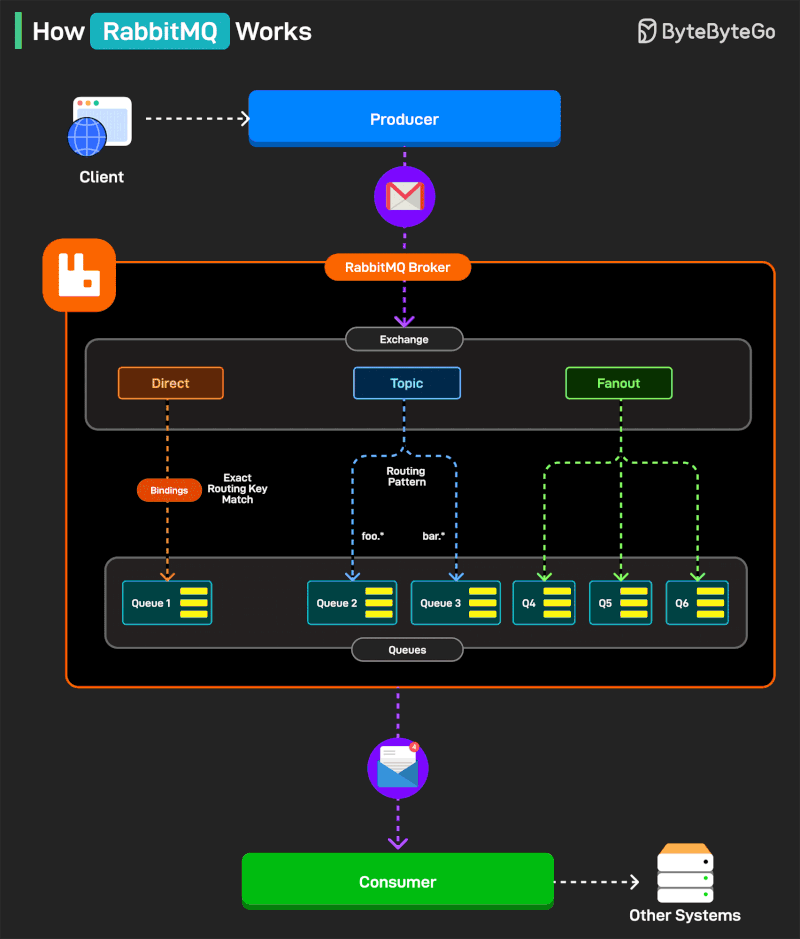

# RabbitMQ

## What is RabbitMQ?

Think of RabbitMQ as a programmable message-routing server between applications.

Your application does not normally send a message directly to another service or even directly to a queue. It sends the message to an exchange, along with a routing key:

```
Publisher
    |
    | publish(exchange, routingKey, message)
    v
 Exchange
    |
    | bindings decide where it goes
    v
 Queue(s)
    |
    | RabbitMQ delivers messages
    v
 Consumer(s)
```

The responsibilities are separated:

Publisher: creates a message and describes where it logically belongs.
Exchange: routes that message.
Queue: stores the message until it can be processed.
Consumer: receives and processes it.
Acknowledgement: tells RabbitMQ that processing succeeded.

RabbitMQ accepts messages from publishers, routes them through exchanges, and stores successfully routed messages in queues until consumers receive them.

RabbitMQ also has:

- a Management UI
- an HTTP management API
- metrics endpoints
- other protocols and clients
- a newer AMQP 1.0 client ecosystem
- RabbitMQ Streams


## Lifecycle of a message

Suppose an HTTP API receives:

```
POST /emails
```

Instead of sending the email synchronously, it publishes:

```json
{
  "email_id": "email-123",
  "recipient": "user@example.com"
}
```

The path is:

```
1. API serializes the message.
2. API publishes it to an exchange.
3. Exchange evaluates its bindings.
4. Message is copied into one or more matching queues.
5. RabbitMQ delivers it to a consumer.
6. Consumer sends the email.
7. Consumer acknowledges the message.
8. RabbitMQ removes it from the queue.
```

Notice the distinction:

```
Published ≠ Routed ≠ Stored ≠ Delivered ≠ Processed
```

These are separate moments, with separate failure possibilities.

That distinction is basically the foundation of reliable RabbitMQ applications.

## Key entities in RabbitMQ



- Publisher
- Exchange
- Queue
- Consumer
- Binding
- Routing key

The producer publishes a message to an exchange, usually with a routing key. The exchange uses its type and bindings to decide which queue or queues should receive that message. Consumers then read messages from those queues.

### Publisher

The publisher is the entity that sends messages to the exchange.

### Exchange

The exchange is the entity that routes messages to the queues.

### Queue

The queue is the entity that stores messages until they are delivered to a consumer.

### Consumer

The consumer is the entity that receives messages from the queue.

### Routing key

A routing key is a label the producer attaches to a message when publishing it.

### Binding

A binding is a rule connecting an exchange to a queue, telling the exchange which messages that queue should receive.

A binding is a rule connecting an exchange to a queue, telling the exchange which messages that queue should receive.

Example:

```
Producer publishes:
message = "Payment completed"
routing key = "payment.completed"
```

Bindings:

```
payments-queue   ← binding key: payment.completed
audit-queue      ← binding key: payment.*
```

The exchange compares the message’s routing key with each binding:

```
Exchange
   ├── payment.completed → payments-queue
   └── payment.*         → audit-queue
```

So both queues may receive the message.

The exact matching behavior depends on the exchange type:

- Direct exchange: routing key must exactly match the binding key.
- Topic exchange: binding keys can contain patterns such as payment.* or payment.#.
- Fanout exchange: routing keys are ignored; every bound queue receives the message.
- Headers exchange: routing is based on message headers rather than the routing key.


## Experiments

1. One queue, one sender, one receiver. Send and receive messages.

